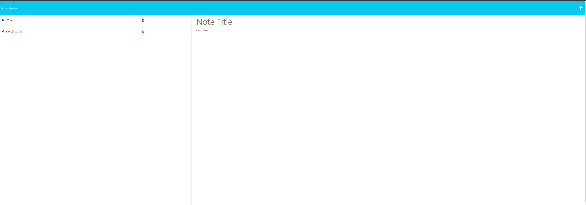

# ReadMeGen: Automated ReadMe File Generator
  
## Table of Contents
- [Description](#description)
- [Installation](#installation)
- [Usage](#usage)
- [Contributing](#contributing)
- [Tests](#tests)
- [License](#license)

## Description
`Note Taker` is an efficient and user-friendly application designed for writing, saving, and managing notes with ease. At its core, it utilizes an Express.js backend, ensuring a fast and reliable performance. This application stands out with its ability to save and retrieve note data from a JSON file, offering a seamless experience for users who need to keep their notes organized and accessible. Whether you're jotting down ideas, organizing tasks, or keeping track of important information, "Note Taker" provides a straightforward and effective solution for all your note-taking needs. With its intuitive interface and robust backend, it's an ideal choice for both personal and professional use.

## Installation
No installation is required.

## Usage
Access the live link to use the application

## Contributing 
n/a

## Tests 
n/a

## License 
None

## Video  &  Links

[Live Demo](https://my-11-notetaker-f80deb15ce51.herokuapp.com/notes) 

## Questions 
If you have any questions, contact me at [mattestin@gmail.com](mailto:mattestin@gmail.com)